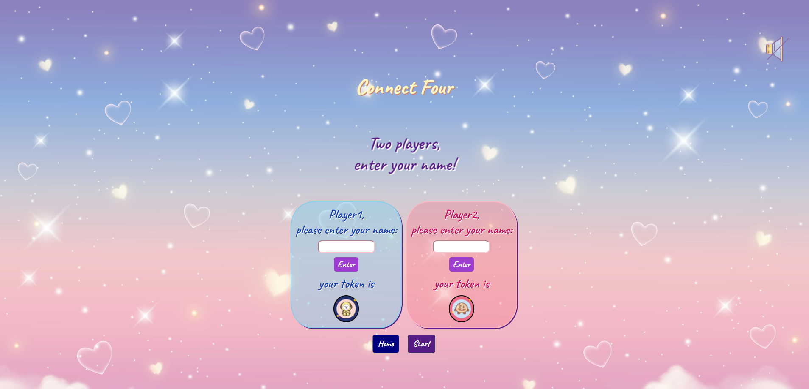
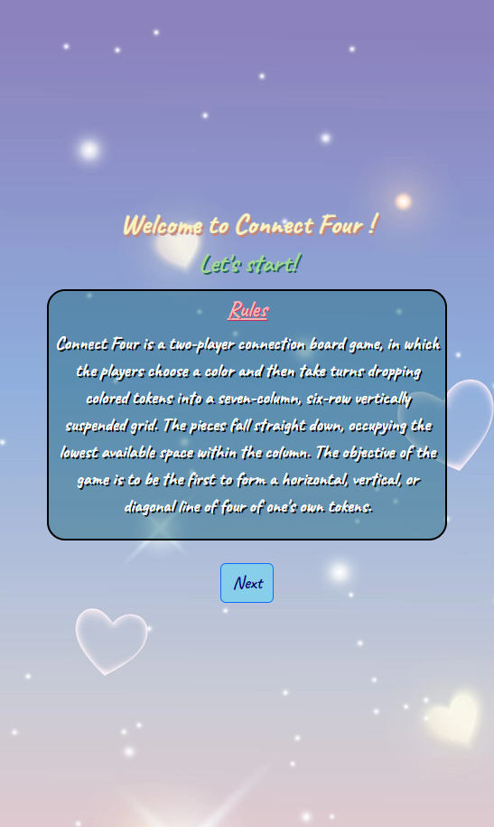

# Connect-Four

- **Your game’s title**: 

  - My game's title is Connect Four. 

  - According to [Wikipedia](https://en.wikipedia.org/wiki/Connect_Four), Connect Four is a two-player connection board game, in which the players choose a color and then take turns dropping colored tokens into a seven-column, six-row vertically suspended grid. The pieces fall straight down, occupying the lowest available space within the column. The objective of the game is to be the first to form a horizontal, vertical, or diagonal line of four of one's own tokens.

  - The reason why I chose the game is because this is the game I am most familiar with in the game list. Besides, starting this course with little knowledge of HTML, CSS, and JS, I believe building a Connect Four game will definitely help me lay my foundation of front-end skills and knowledge.  

- **Getting Started**: 

  - [Press here to play the game!](https://anchi-chen-connect-four.netlify.app/)
  - If you are not familiar with Connect Four, please read the rules carefully and then press next button on the bottom of the page.
  - Next, please enter the names of two players and press the enter buttons.
  - If you would like some sound effects or background music, make sure to turn on the audio by **clicking the audio icon** above!
  - The game will **start from player 1**.
  - The last but not the least, good luck!

- **Screenshot(s):** 
  - Home Page in Large Screen 
    <!-- -  -->
    - 

  - Name Page in Large Screen
    - 

  - Game Page in Large Screen
    - 

  - Home Page in small Screen
    <!-- -  -->
    - 
  - Name Page in small Screen
    - 

  - Game Page in small Screen
    - 

- **Technologies Used**: HTML, CSS, JS.

- **Next Steps**: 

  - Let the player choose their own token, theme color, dark mode.
  - Let the player enter their name at different page from the game page.
  - Set a timer for adding the token in certain time.
  - Add history record, including players' names, time cost to win, date, the count of winning and losing, etc.

- **credential**:

  - Icons from [ICONS8](https://icons8.com/).

  - Music and sound effect from [PIXABAY](https://pixabay.com/)(https://pixabay.com/sound-effects/stone-dropping-6843/).

  - Background image from [Vecteezy](https://www.vecteezy.com/).

  - Fonts from [Google Fonts](https://fonts.google.com/).

  - Animations from [Animate.css](https://animate.style/).
